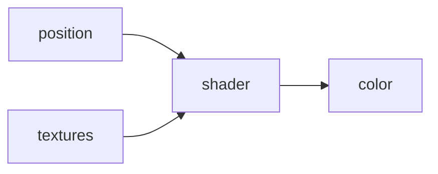

## Shaders

https://thebookofshaders.com/01/
### What is a Shader
#### Types of Shaders

##### Fragment Shaders

Takes a position and outputs a color



More or less

##### Vertex Shader

??? #inprogress

Responsible for rendering shapes.

#### GLSL

OpenGLs Shader Language

Single main function that returns void

Returns through some "special global variables" such as `gl_FragColor`

No automatic casting

##### Example

```glsl
#ifdef GL_ES
precision mediump float;
#endif

uniform float u_time;

void main() {
	gl_FragColor = vec4(0.309,0.962,1.000,1.000);
}
```

##### Uniforms

https://thebookofshaders.com/03/

What is a `uniform`? uniforms are the way data is exchanged between the CPU and GPU, this indicates it is UNIFORM across ALL pixels being processed by the GPU, the types supported are:

- `float`, `vec2`, `vec3`, `vec4`, `mat2`, `mat3`, `mat4`, `sampler2D` and `samplerCube`

Uniforms are defined with the corresponding type at the top of the shader right after assigning the default floating point precision.

`u_` is a common prefix, sometimes they get an `i` prefix to indicate that they are inputs.

##### Common Functions

The GPU has hardware accelerated angle, trigonometric and exponential functions. Some of those functions are: [`sin()`](https://thebookofshaders.com/glossary/?search=sin), [`cos()`](https://thebookofshaders.com/glossary/?search=cos), [`tan()`](https://thebookofshaders.com/glossary/?search=tan), [`asin()`](https://thebookofshaders.com/glossary/?search=asin), [`acos()`](https://thebookofshaders.com/glossary/?search=acos), [`atan()`](https://thebookofshaders.com/glossary/?search=atan), [`pow()`](https://thebookofshaders.com/glossary/?search=pow), [`exp()`](https://thebookofshaders.com/glossary/?search=exp), [`log()`](https://thebookofshaders.com/glossary/?search=log), [`sqrt()`](https://thebookofshaders.com/glossary/?search=sqrt), [`abs()`](https://thebookofshaders.com/glossary/?search=abs), [`sign()`](https://thebookofshaders.com/glossary/?search=sign), [`floor()`](https://thebookofshaders.com/glossary/?search=floor), [`ceil()`](https://thebookofshaders.com/glossary/?search=ceil), [`fract()`](https://thebookofshaders.com/glossary/?search=fract), [`mod()`](https://thebookofshaders.com/glossary/?search=mod), [`min()`](https://thebookofshaders.com/glossary/?search=min), [`max()`](https://thebookofshaders.com/glossary/?search=max) and [`clamp()`](https://thebookofshaders.com/glossary/?search=clamp).

##### gl_FragCoord

`gl_FragCoord`, which holds the screen coordinates of the _pixel_ or _screen fragment_ that the active thread is working on

Normalizing to between 0.0 and 1.0: 	`vec2 st = gl_FragCoord.xy/u_resolution;`

(0,0) is bottom left corner

#### Requirements for Shaders
##### Blind
- Cannot know what other threads in the pipeline are doing
-

##### Memoryless
- Cannot maintain memory past execution

#### Why?

- GPUs execute shaders in parallel, and keep everything busy. This allows for fast parallel operations, has to meet the above requirements

#### WebGL as a good platform for learning